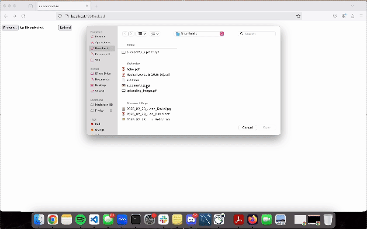

# Overview

This repo provides a Dockerized setup for deploying a Flask web application using PostgreSQL, Gunicorn, and Nginx. In development, the setup uses Flask's built-in server, but in production it uses Gunicorn as the WSGI server and Nginx as a reverse proxy. 

# Successful Uploading of "successful.jpeg" Image in Production



# Build Instructions
## Development
You can build and start the containers by running this command:
```
docker compose up -d --build
```
You can now access the application at http://localhost:9090. For development, the code changes apply automatically as the "web" folder is mounted into the container. 

## Production
You can build and start the containers by running this command:
```
docker compose -f docker-compose.prod.yml up -d --build
```
You can now access the application at http://localhost:1351. For production, no folders are mounted, so in order to make changes, you must rebuild the image using the above command. 

## Accessing Application via SSH (Port Forwarding)
To access the application remotely, use SSH with port forwarding. Add the following to your SSH command:
```
ssh -L localhost:8080:localhost:9090 user@remote-server
```
This will forward port '9090' on the remote server to port '8080' on your local machine. After this, you can access the webpage in Firefox at http://localhost:8080. So, for our case, the command would look like this for development and production:

### Development
```
ssh -L localhost:9090:localhost:5000 user@remote-server
```

### Production
```
ssh -L localhost:1351:localhost:1351 user@remote-server
```

Happy building :)
